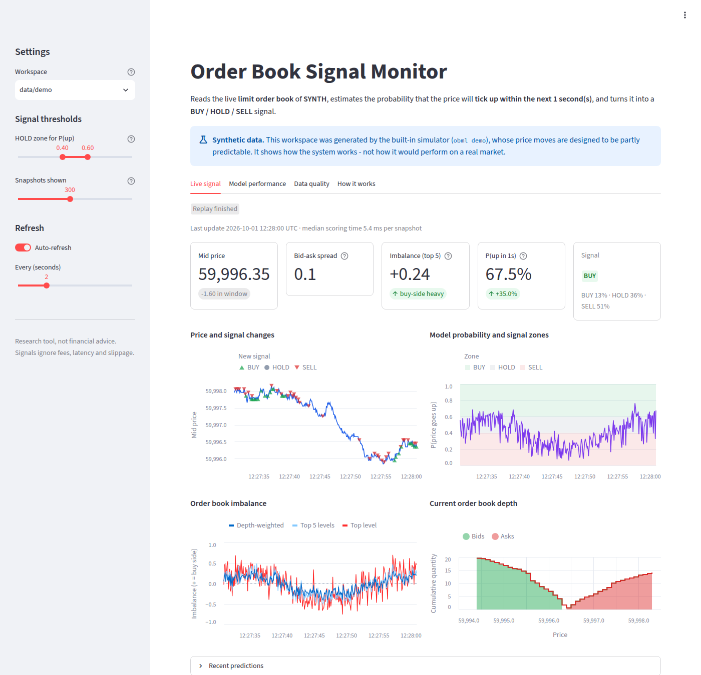
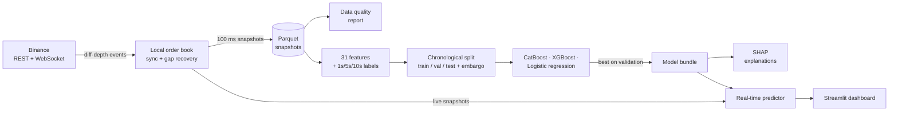
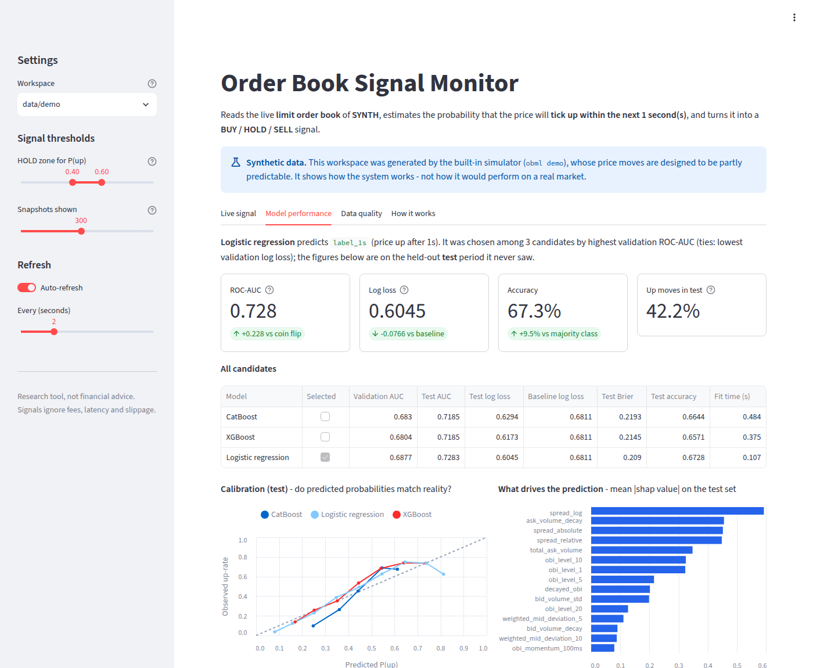
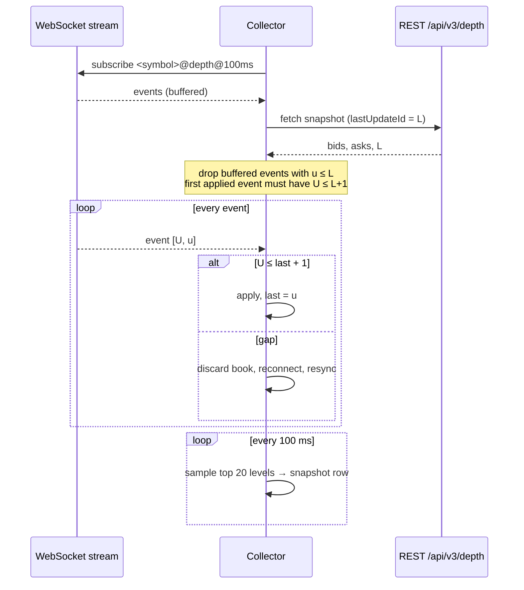

# Order Book ML

**Short-horizon crypto price-direction forecasting from the live Binance limit order book.**

[](https://github.com/sakshamg251206/quant-orderbook-ml/actions/workflows/ci.yml)


Order Book ML records the Binance order book ten times per second, turns every snapshot into
31 market-microstructure features, trains and compares gradient-boosted and linear models to
estimate **the probability that the price will tick up within the next few seconds**, and
streams those probabilities as **BUY / HOLD / SELL** signals to a live dashboard.


<sub>The dashboard running on the built-in **synthetic** demo data (`obml demo`). The
simulator is designed to be partly predictable, so these numbers show the system working,
not real-market performance.</sub>

---

## Contents

- [Why this exists](#why-this-exists)
- [How it works](#how-it-works)
- [Features](#features)
- [Quick start (2 minutes, no account needed)](#quick-start)
- [Using real Binance data](#using-real-binance-data)
- [Configuration](#configuration)
- [Architecture](#architecture)
- [Project structure](#project-structure)
- [Testing and quality checks](#testing-and-quality-checks)
- [Deployment](#deployment)
- [Key technical decisions](#key-technical-decisions)
- [Limitations and future work](#limitations-and-future-work)

## Why this exists

Every exchange keeps an **order book**: the list of buyers (bids) and sellers (asks) waiting
at each price. It is the most granular public view of supply and demand. A well-known
result in market microstructure is that **order book imbalance** — much more volume waiting
to buy than to sell, or vice versa — carries a small amount of information about the next
price move over very short horizons.

This project is an end-to-end, reproducible research system for testing that idea on real
crypto markets. It solves the parts that are easy to get subtly wrong:

- **Maintaining a correct local order book** from Binance's incremental update stream
  (sequence checks, gap detection, automatic resynchronisation).
- **Building labels and splits without leaking the future** into training data.
- **Evaluating honestly**: a held-out time period, comparison to a naive baseline, and
  calibration, not just accuracy.
- **Serving the model in real time** with the exact same feature code used in training.

## How it works

In plain terms:

1. **Watch** — connect to Binance and keep an up-to-date copy of the order book.
2. **Measure** — every 100 ms, describe the book with numbers: how lopsided it is, how wide
   the gap between best buy and sell price is, how volume is spread across price levels,
   and how all of that is changing.
3. **Learn** — label each moment with what actually happened next ("was the price higher
   1 second later?") and train models to predict that label from the measurements.
4. **Predict** — run the best model on the live stream and turn its probability into a
   signal: **BUY** if P(up) ≥ 0.60, **SELL** if ≤ 0.40, otherwise **HOLD** (adjustable).



## Features

| Area | What you get |
|---|---|
| **Data collection** | Async Binance L2 collector following the official order book sync procedure; buffered events, sequence-gap detection, exponential-backoff reconnects; batched, atomic Parquet writes. No API key required. |
| **Data quality** | Gap, crossed-book, empty-side and spread-outlier checks with a quality score and chart. |
| **Features** | 31 scale-free microstructure features in six groups: multi-level imbalance, spread, depth/volume, micro-price, book shape, short-term dynamics. Vectorised, ~3 ms per tick. |
| **Labels** | "Price up after *h* seconds" for 1/5/10 s, matched to the first snapshot at/after *t + h*; undefined across data gaps instead of using stale prices. |
| **Modelling** | CatBoost, XGBoost and standardised logistic regression; early stopping and model selection on a validation period; final metrics on an untouched test period with a base-rate baseline. |
| **Explainability** | SHAP summary, importance and dependence plots; auto-generated model card. |
| **Real-time inference** | Live stream or replay of recorded data, identical feature code to training, per-tick latency measurement, outputs consumable by the dashboard. |
| **Dashboard** | Live signal, price, imbalance, probability and depth charts; model comparison, calibration and feature importance; data-quality view; plain-language explainer; guided setup when empty. Works on mobile. |
| **Offline demo** | A synthetic order book simulator so the whole pipeline runs without network access — also used by the test suite. |


<sub>Model performance tab on synthetic demo data.</sub>

## Quick start

Requires **Python 3.11+**.

```bash
git clone https://github.com/sakshamg251206/quant-orderbook-ml.git
cd quant-orderbook-ml
make install                 # creates .venv and installs the package + dev tools
source .venv/bin/activate

obml demo                    # simulate data -> build dataset -> train -> explain -> replay (~1 min)
obml dashboard               # opens http://localhost:8501
```

Without `make`: `python -m venv .venv && source .venv/bin/activate && pip install -e ".[dev]"`.

`obml demo` writes everything to `data/demo/`, separate from real data. The dashboard picks
it up automatically (switch workspaces in the sidebar).

## Using real Binance data

```bash
obml collect --minutes 30    # record the live BTCUSDT book (Ctrl+C to stop early)
obml validate                # optional: data-quality report and chart
obml build-dataset           # features, labels, chronological split
obml train                   # compare models, keep the best, write the model card
obml explain                 # optional: SHAP analysis
obml predict                 # score the live stream; open `obml dashboard` alongside
```

`obml status` shows which steps are done and what to run next. Every command accepts
`--data-dir` and `--symbol`; run `obml <command> --help` for all options, e.g.
`obml train --target label_5s --models catboost logreg` or
`obml predict --replay data/snapshots --realtime`.

> **Region note:** Binance returns HTTP 451 in some jurisdictions (including the US). The
> collector reports this clearly; point `OBML_BINANCE_REST_URL` / `OBML_BINANCE_WS_URL` at an
> endpoint that serves your region (e.g. Binance.US) — or use the synthetic demo.

Collect at least ~30 minutes for meaningful results; very quiet markets can produce labels
that are almost all "not up", which `obml train` detects and reports.

## Configuration

All settings are optional environment variables (or a `.env` file — copy
[`.env.example`](.env.example)). Values are validated at start-up.

| Variable | Default | Purpose |
|---|---|---|
| `OBML_DATA_DIR` | `data` | Workspace for snapshots, datasets, models, reports, predictions |
| `OBML_SYMBOL` | `BTCUSDT` | Binance spot symbol |
| `OBML_DEPTH` | `20` | Price levels stored per side |
| `OBML_SNAPSHOT_INTERVAL_MS` | `100` | Sampling interval of the local book |
| `OBML_BATCH_SIZE` | `600` | Snapshots per Parquet file |
| `OBML_BINANCE_REST_URL` | `https://api.binance.com` | REST endpoint (depth snapshots) |
| `OBML_BINANCE_WS_URL` | `wss://stream.binance.com:9443` | WebSocket endpoint (diff-depth stream) |
| `OBML_BUY_THRESHOLD` | `0.60` | BUY when P(up) ≥ this |
| `OBML_SELL_THRESHOLD` | `0.40` | SELL when P(up) ≤ this |
| `OBML_LOG_LEVEL` | `INFO` | `DEBUG`, `INFO`, `WARNING`, `ERROR` |

No credentials are needed or stored: only public market data is used.

## Architecture

### Keeping the order book in sync

Binance publishes the book as a REST snapshot plus a stream of incremental updates, each
covering a range of update ids `[U, u]`. Applying an update out of order or missing one
silently corrupts the book, so the collector follows the documented procedure and rebuilds
from scratch on any gap:



The synchronisation rules live in a network-free state machine
([`orderbook.py`](src/orderbook_ml/orderbook.py), [`collector.py`](src/orderbook_ml/collector.py))
that is unit-tested, and the full networking path is tested against a local fake Binance
server that deliberately injects a sequence gap.

### Leakage-free evaluation

```mermaid
gantt
    dateFormat X
    axisFormat %s
    section Time →
    Train (70%)        :a, 0, 70
    embargo            :crit, 70, 72
    Validation (15%)   :b, 72, 85
    embargo            :crit, 85, 87
    Test (15%)         :c, 87, 100
```



- Splits are **contiguous in time** — never shuffled.
- An **embargo** equal to the longest label horizon (10 s) removes the last rows before each
  boundary, because their labels look into the next period.
- **Validation** drives early stopping and model selection; **test** is used once, for
  reporting.
- Every feature at time *t* uses only snapshots ≤ *t* (enforced by a test that alters the
  future and checks the past is unchanged), and leading rows are filled with "no change"
  rather than back-filled from the future.

### Workspace layout

Everything one run produces lives under one directory, so live and demo data never mix:

```
data/                       # OBML_DATA_DIR
├── snapshots/              # raw <SYMBOL>_<time>.parquet batches
├── processed/              # train/validation/test.parquet, dataset_meta.json, shap_values.npy
├── models/model.joblib     # model + feature list + target + provenance, in one bundle
├── reports/                # data_quality, training_report.json, model_card.md, charts
├── predictions/            # live.parquet, latest_book.json, session.json, history/
└── logs/
```

## Project structure

```
.
├── src/orderbook_ml/
│   ├── cli.py              # `obml` command-line interface
│   ├── config.py           # validated settings + workspace layout
│   ├── orderbook.py        # local order book state machine and snapshot schema
│   ├── collector.py        # live Binance stream (aiohttp), sync, reconnects
│   ├── synthetic.py        # offline order book simulator
│   ├── storage.py          # batched, atomic Parquet/JSON persistence
│   ├── validation.py       # data-quality checks and chart
│   ├── features.py         # 31 microstructure features
│   ├── labels.py           # forward-looking direction labels
│   ├── dataset.py          # dataset build + chronological split with embargo
│   ├── modeling.py         # training, metrics, selection, model bundle
│   ├── reporting.py        # training charts and model card
│   ├── explain.py          # SHAP analysis
│   ├── inference.py        # real-time predictor and output sink
│   ├── status.py           # pipeline progress (CLI + dashboard onboarding)
│   └── dashboard/          # Streamlit app + testable data layer
├── tests/                  # pytest suite (unit, integration, dashboard rendering)
├── docs/images/            # README screenshots
├── .github/workflows/ci.yml
├── Dockerfile, docker-compose.yml
├── Makefile
└── pyproject.toml
```

## Testing and quality checks

```bash
make check        # = make lint typecheck test
make test         # pytest with coverage
```

The suite (~60 tests, under a minute) covers order book sync rules, the collector against a
fake Binance server, storage, feature values and look-ahead safety, label alignment,
split/embargo logic, training and selection, SHAP, streaming-vs-batch inference parity, the
CLI end to end, and headless rendering of the Streamlit app. CI runs lint (ruff), type
checks (mypy) and tests on Python 3.11 and 3.12, and builds the Docker image.

## Deployment

**Docker Compose** runs the collector, the live predictor and the dashboard against a shared
volume:

```bash
cp .env.example .env                                   # optional
docker compose build
docker compose run --rm collector obml collect --minutes 30
docker compose run --rm collector obml build-dataset
docker compose run --rm collector obml train
docker compose up -d                                   # dashboard on http://localhost:8501
```

The image runs as a non-root user and stores all state in the `/data` volume. For a demo-only
deployment: `docker run -p 8501:8501 orderbook-ml sh -c "obml demo && obml dashboard --host 0.0.0.0"`.

The dashboard has no authentication; put it behind a reverse proxy with auth if you expose
it beyond localhost.

## Key technical decisions

- **`aiohttp` instead of an exchange SDK.** The sync logic is the hard part, so it is
  implemented explicitly and tested; the dependency footprint is smaller and no API keys are
  involved.
- **Scale-free features.** Absolute price levels (mid, micro-price) were replaced by
  deviations and ratios so models learn book dynamics rather than the price regime of the
  training window.
- **One model bundle.** The estimator, feature order, target horizon and provenance are saved
  together, so inference cannot silently pair a model with the wrong features. Logistic
  regression carries its own scaler inside a scikit-learn pipeline.
- **Honest metrics.** ROC-AUC and log loss are reported next to a base-rate baseline;
  undefined metrics are reported as undefined rather than as 0.5; training refuses
  single-class data instead of patching labels.
- **Same code path online and offline.** The real-time predictor reuses `compute_features`
  over a rolling window; a test asserts streaming probabilities equal batch probabilities.
- **Synthetic data is labelled as such everywhere** — in the dataset metadata, model card,
  model bundle and dashboard — and a synthetic model is refused for live trading signals.
- **Files over services.** Parquet + JSON with atomic writes are enough for one symbol at
  10 Hz and keep the project easy to run; the dashboard reads them read-only.

## Limitations and future work

- **No real-market results are published here.** The sandbox used to build this version had
  no access to Binance, so all included screenshots use synthetic data. Run `obml collect`
  to evaluate on real markets.
- Single chronological split; a **walk-forward evaluation** would give more robust estimates.
- Signals are not a strategy: there is **no backtest with fees, latency or queue position**.
- One symbol per workspace; no cross-asset features.
- "Up vs not up" folds flat and down moves together; a three-class or return-regression
  target is a natural extension.
- Files are fine for a single machine; multi-symbol or long-running deployments would benefit
  from a time-series store.
- `model.joblib` uses pickle — only load models you trained yourself.
